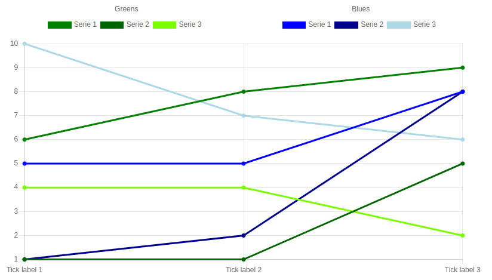

# chartjs-plugin-groupedlegend

[](https://opensource.org/licenses/MIT)
[](http://www.typescriptlang.org/)

A grouped legend plugin for ChartJS 3 and 4 written in TypeScript.

Allows you to group datasets using HTML legend:



## Installation

```bash
npm install chartjs-plugin-groupedlegend
```

## Usage

Check out the example [here](/example/). Run the code with `npm run dev`.

## Options

| Option name | Type                    | Default value | Description                    |
| ----------- | ----------------------- | ------------- | ------------------------------ |
| `display`   | `boolean`               | `true`        | Whether to display the legend. |
| `position`  | `GroupedLegendPosition` | `'top'`       | The position of the legend.    |
| `groups`    | `Array<DatasetGroup>`   | `[]`          | The groups of the legend.      |

`GroupeLegendPosition` is a string with the following possible values:

-   `'top'`
-   `'left'`
-   `'bottom'`
-   `'right'`

`DatasetGroup` is an object with the following properties:

-   `name`: The name of the group.
-   `datasets`: An array of `ChartDataset` objects.

## License

MIT
